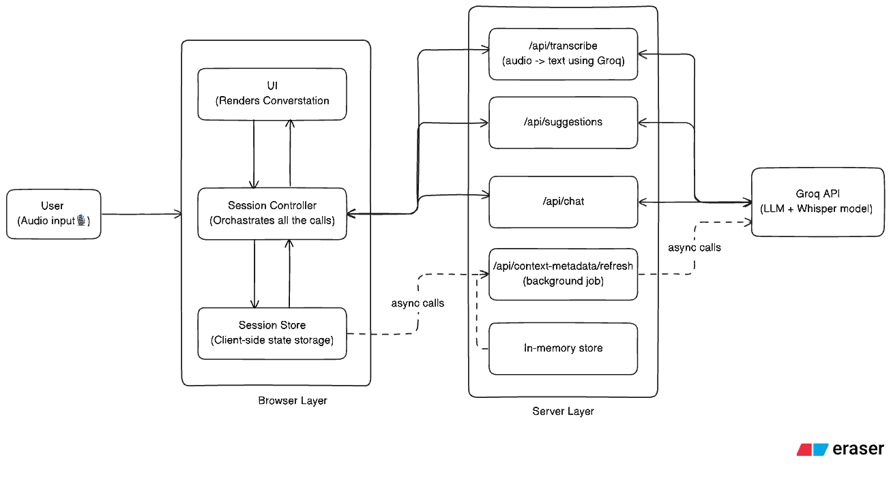

# TwinMind Live Suggestions

Next.js app for live meeting assistance with three panes:

- Transcript from microphone audio
- Three refreshed suggestion cards
- Chat for typed questions or expanded suggestion answers

## Setup

```bash
npm install
npm run dev
```

Open the app, add your Groq API key in `Settings`, allow microphone access, and start recording.

## Design



## USPs(Optimisation)

- `⚡` **Flash reload** mode starts the reload flow when about 90% of `Auto refresh seconds` has elapsed, so the next suggestion batch can appear faster.
  With a `30s` auto-refresh window, this can cost roughly the last 7 words on average.
- A `background metadata service` periodically builds a compact snapshot from recent transcript, rolling summary, suggestion history, and clicked-suggestion patterns. Suggestions and chat use it as guidance for mode, tone, likely next need, and risks, while the refresh runs asynchronously so it does not sit on the visible suggestion/chat latency path.
- Suggestions and chat use bounded recent context plus a compact `rolling summary` instead of the full transcript, which keeps prompts smaller and refreshes faster.

## Behavior

- Audio is recorded in chunks and transcribed with Groq Whisper.
- Suggestions refresh automatically on a timer and can also be reloaded manually.
- Clicking a suggestion opens a streamed detailed answer in chat.
- Sessions can be exported as JSON from the top bar.

## Storage

- Settings are stored in `sessionStorage` for the current tab.
- Session data is kept in memory during runtime and exported client-side.
- There is no database, auth, or shared persistence.

## Important Files

- `app/page.tsx`: app entry point.
- `components/app-shell.tsx`: top-level 3-column layout and settings/export shell.
- `lib/session-controller.tsx`: main client orchestration for recording, transcription, refresh, and chat flows.
- `lib/session-store.ts`: Zustand session state and settings.
- `app/api/transcribe/route.ts`: Groq Whisper transcription route.
- `app/api/suggestions/route.ts`: live suggestion generation route.
- `app/api/chat/route.ts`: streamed chat response route.
- `lib/context-metadata-service.ts`: background metadata refresh pipeline.
- `lib/prompts.ts`: default prompts for suggestions, chat, and metadata.

## Scripts

```bash
npm run dev
npm run build
npm run start
npm run typecheck
```
